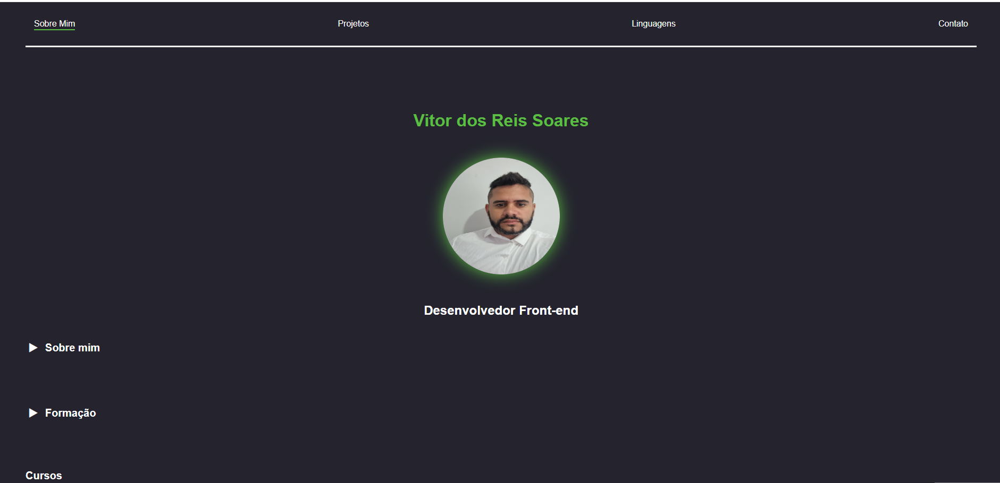

# Portfólio - Vitor dos Reis

Este repositório contém o código do meu portfólio pessoal como desenvolvedor Front-End.  
O objetivo do projeto é apresentar meus projetos, habilidades e formas de contato de maneira organizada e responsiva.

O site foi desenvolvido com foco em boas práticas de HTML, CSS e JavaScript, além de organização de código e experiência do usuário.

---

## 🚀 Tecnologias utilizadas

- HTML5
- CSS3
- JavaScript
- Design responsivo
- Git e GitHub

---

## ✨ Funcionalidades

- Apresentação pessoal
- Lista de projetos desenvolvidos
- Projeto em destaque
- Links para repositórios no GitHub
- Botão de copiar e-mail para contato
- Botão de voltar ao topo da página
- Navegação com destaque da seção ativa
- Interface responsiva

---
## Preview

---

🌐 **Projeto online:**  
👉 [portfolio](https://vitor-dos-reis.vercel.app/)

---

## 🎯 Objetivo do projeto

Este projeto foi desenvolvido como parte da evolução dos meus estudos em desenvolvimento Front-End, com o objetivo de consolidar conhecimentos em:

- estruturação semântica com HTML
- estilização e layout com CSS
- interatividade com JavaScript
- organização de projetos

---

## 👨‍💻 Autor

Desenvolvido por **Vitor dos Reis**
